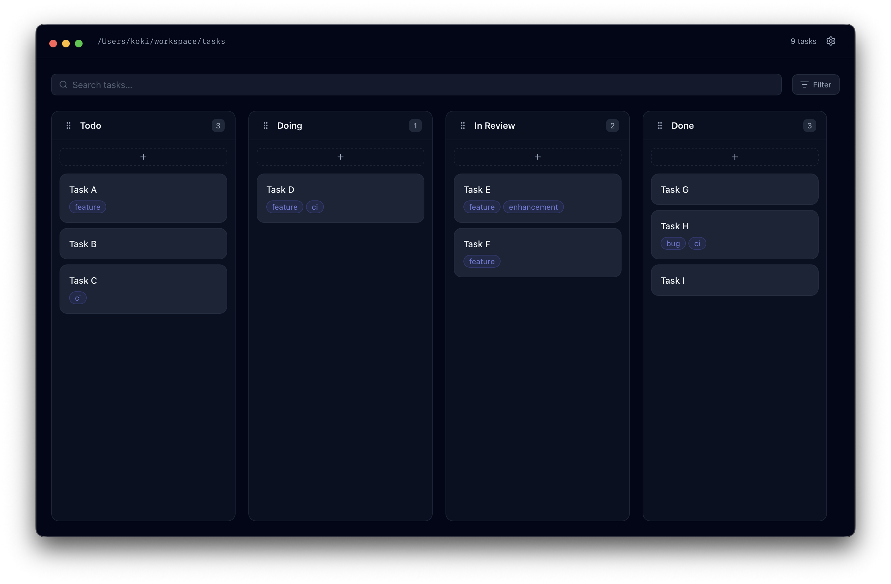

<h1 align="center">Cork</h1>

<p align="center">

</p>

<p align="center">
<i>Kanban board for local Markdown files.</i>
</p>

<p align='center'>
<a href="https://github.com/koki-develop/Cork/releases/latest"></a>
<a href="./LICENSE"></a>
<a href="https://github.com/koki-develop/Cork/actions/workflows/ci.yml"></a>

</p>

<p align="center">

</p>

## Installation

```
brew install --cask koki-develop/tap/cork
```

## License

[MIT](./LICENSE)
