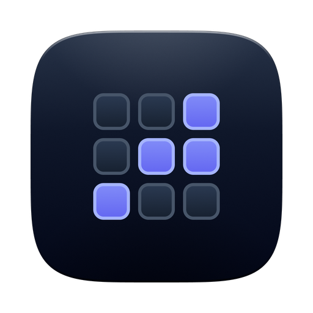
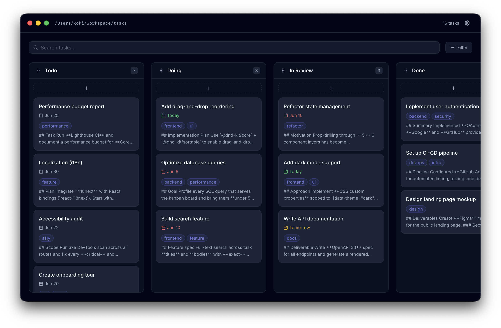
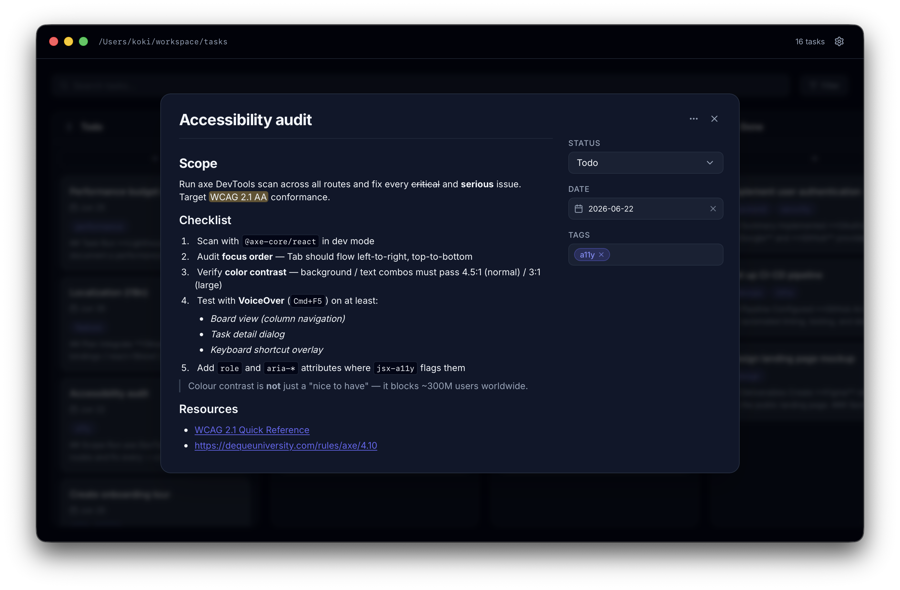
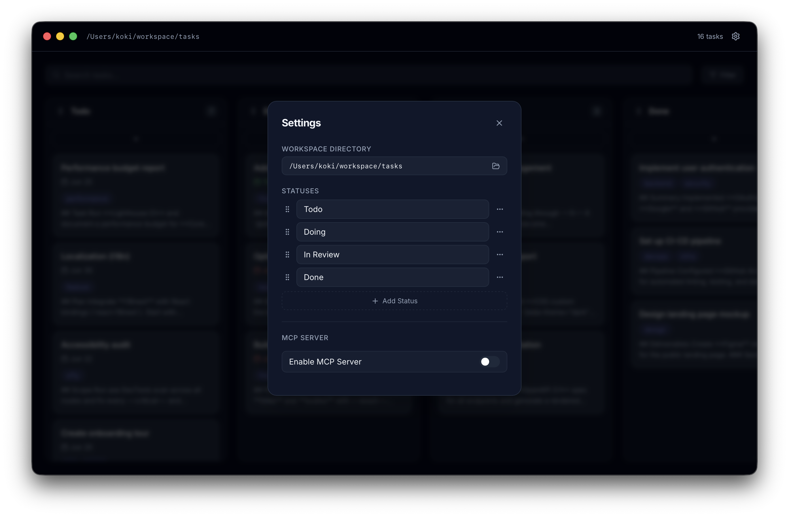

<h1 align="center">Cork</h1>

<p align="center">

</p>

<p align="center">
<i>Kanban board for local Markdown files.</i>
</p>

<p align='center'>
<a href="https://github.com/koki-develop/Cork/releases/latest"></a>
<a href="./LICENSE"></a>
<a href="https://github.com/koki-develop/Cork/actions/workflows/ci.yml"></a>

</p>

<p align="center">



</p>

## Installation

```
brew install --cask koki-develop/tap/cork
```

## How it works

Cork has no database. A workspace is just a folder, and every task is a plain Markdown file inside it — so your board lives entirely in version-controllable, editor-friendly text.

- **One task = one `.md` file.** The file name is the task title; the Markdown body is the task description.
- **Frontmatter holds the metadata.** `status`, `tags`, and `date` live in the YAML frontmatter at the top of each file.

```markdown
---
status: In Progress
tags:
  - feature
  - urgent
date: 2026-06-12
---

Write the project README, including a "How it works" section.
```

Because it's all just files, you can edit tasks in any editor, grep them, and track the whole board in Git.

## CLI

Installing via Homebrew also puts a `cork` command on your `PATH`.

```sh
# Open a new window.
cork

# Open a directory as a workspace.
cork ./path/to/workspace
```

## License

[MIT](./LICENSE)
